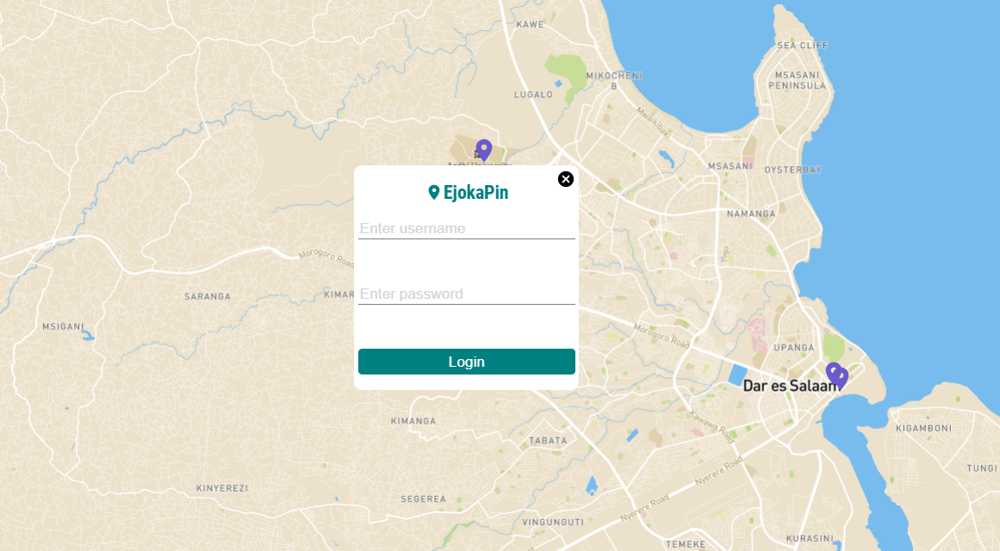

# Mapping Places
It's an app that pins location of different places. A user can create a review about the place he/she visited and add rating to the place. A user can register on the app and when a user logs in, a user can see the user's pin location color coded differently compared to other users. 

# Live Link
<a href="https://ejokadashboard.netlify.app/">Click Here</a>

## Built With

- ReactJS
- NodeJS
- Material-ui Icons
- CSS
- MongoDB

## Getting Started

Open your terminal or text editor and use next command

        git clone https://github.com/emmanuelkamala/mapping-places.git

        cd backend
        ### run 'yarn install' or 'npm install' to install dependencies
        ### yarn start

        cd frontend
        ### run 'yarn install' or 'npm install' to install dependencies
        ### yarn start

## Opening the app

Then open the browser and enter this link:
http://localhost:3000

After if you want to do any changes please create new branch, after changes open pull request.
Happy coding! 

## Authors

👤 **Author1**

- Github: [emmanuelkamala](https://github.com/emmanuelkamala)
- Twitter: [ejkamala](https://twitter.com/ejkamala)
- Linkedin: [emmanuelkamala](https://linkedin.com/in/emmanuelkamala)

## 🤝 Contributing

Contributions, issues and feature requests are welcome!

Feel free to check the [issues page](issues/).

## Show your support

Give a ⭐️ if you like this project!

## 📝 License

This project is [MIT](lic.url) licensed.
